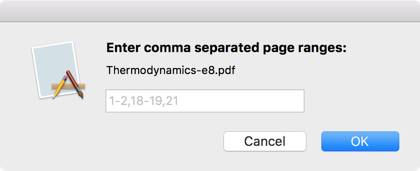

[004.42Apple_CorePrintingExample][t]
====================================
[t]:https://github.com/marc-medley/004.42Apple_CorePrintingExample

_macOS [Core Printing](https://developer.apple.com/documentation/applicationservices/core_printing) PDF print example with technical notes._

<a id="toc"></a>
| [PDFPagePrinter](#PDFPagePrinter) | [Technical Notes](#TechnicalNotes) | [Utility Routines](#UtilityRoutines) | [Resources](#Resources) | 

<a id="PDFPagePrinter"></a>
PDFPagePrinter [▴](#toc)
--------------

PDFPagePrinter is an example Swift macOS Core Printing application which prints multiple ranges of PDF pages using the same printer settings.



PDFPagePrinter source code is contained in [AppDelegate.swift](PDFPagePrinter/PDFPagePrinter/AppDelegate.swift).

<a id="TechnicalNotes"></a>
Technical Notes [▴](#toc)
---------------

[TN2155_SavingPrinterSettingsForAutomaticPrinting.md](TN2155_SavingPrinterSettingsForAutomaticPrinting.md) provides a possible (unofficial) Swift interpretation of Apple's Objective-C Technical Note [TN2155 Saving Printer Settings for Automatic Printing](https://developer.apple.com/library/content/technotes/tn2155/_index.html) (revision 2007.03.29).

[TN2248_UsingCocoaAndCorePrintingTogether.md](TN2248_UsingCocoaAndCorePrintingTogether.md) provides a possible (unofficial) Swift interpretation of Apple's  Objective-C Technical Note [TN2248 Using Cocoa and Core Printing Together](https://developer.apple.com/library/content/technotes/tn2248/_index.html) (revision 2009.05.27).

[TN2155.swift](PDFPagePrinter/PDFPagePrinter/TN2155.swift) and [TN2248.swift](PDFPagePrinter/PDFPagePrinter/TN2248.swift) files lightly containg tested Swift implementations for the technical notes code listings.  

_NOTE: The source code files may contian more complete and up-to-date Swift code than the example listings in the corresponding markdown files._

<a id="UtilityRoutines"></a>
Utility Routines [▴](#toc)
----------------

[PrintUtil.swift](PDFPagePrinter/PDFPagePrinter/PrintUtil.swift) provides methods which return a `Dictionary` of values for various _Core Printing_ `OpaquePointer` types.

``` swift
getPMPageFormatInfo(pmPageFormat: PMPageFormat) -> Dictionary<String, Any>
getPMPaperInfo(pmPaper: PMPaper) -> Dictionary<String, Any>
getPMPrinterInfo(pmPrinter: PMPrinter) -> Dictionary<String, Any>
getPMPrintSessionInfo(pmPrintSession: PMPrintSession) -> Dictionary<String, Any>
getPMPrintSettingsInfo(pmPrintSettings: PMPrintSettings) -> Dictionary<String, Any>
```

<a id="Resources"></a>
Resources [▴](#toc)
---------

[Apple/ApplicationServices: Core Printing ⇗](https://developer.apple.com/documentation/applicationservices/core_printing)  
[Apple/Technical Note: TN2155 Saving Printer Settings for Automatic Printing ⇗](https://developer.apple.com/library/content/technotes/tn2155/_index.html) _2007-03-29_  
[Apple/TechnicalNote: TN2248 Using Cocoa and Core Printing Together ⇗](https://developer.apple.com/library/content/technotes/tn2248/_index.html) _2009-05-27_  

[GitHub/maxbaeumle: splinter ⇗](https://github.com/maxbaeumle/splinter)  

[StackOverflow: How to use UnsafeMutablePointer<OpaquePointer> in Swift? ⇗](https://stackoverflow.com/questions/44893912/how-to-use-unsafemutablepointeropaquepointer-in-swift)


